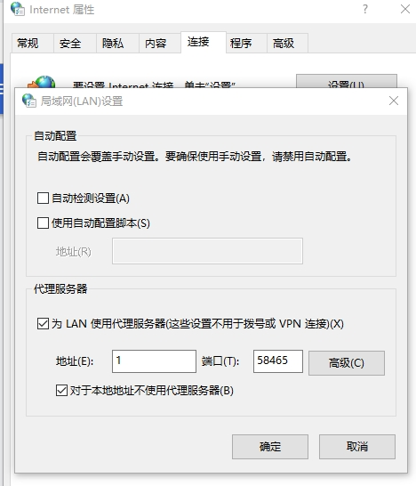

# 说明
可能有用的github项目列表。列表暂不分类，等项目多了，会分类

# 项目列表
### 1. [proxyservice](https://github.com/Jwnie/proxyservice)

- 关键字：代理 爬虫 多ip ip池

`代理是客户端不直接访问某网站，通过某个中介服务器间接访问，可以隐藏本机ip`。如百度搜索ip，可以看到设置代理之后的ip不一样了。  
> > 作者介绍：抓取网上公开代理，维护可供爬虫使用的IP池，区分墙内墙外、http/https/socks代理。
> 
> 可以通过访问`http://localhost:8888/proxy/getProxy?isDemostic=true&anonymousType=elite&protocolType=https`软件接口的形式一次性100个可用代理，利用多个代理，写爬虫爬别的网站的数据，就不怕一个ip被封了。

- 手动设置：首页有一些网站，网站提供免费的代理ip、端口号，可以设置浏览器代理（设置ip和端口号），如下图。
   
手动设置作用不大，不能访问google，但相当于本机有多个ip了，爬虫爬数据很方便。

 

> 以后如果要用爬虫爬数据，可以关注这个项目。

# 列表项模板说明

### 序号. [项目名](链接)

- 关键字：aa、bb、cc

> > 作者介绍：xxxx
>
> 我总结下作用

其他说明

> 什么时候可能会用到这个项目

over

ps: 如果遇到更好的模板可以进一步完善
